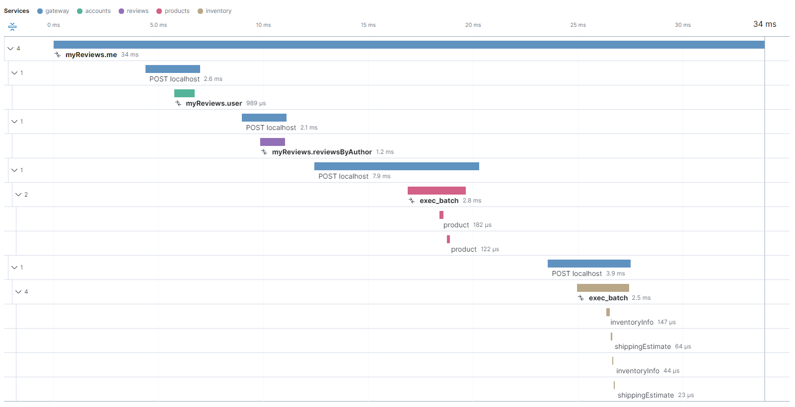

## GraphQL Observability with Elastic APM and HotChocolate

### Quick start

1. `git clone https://github.com/glucaci/elastic-apm-poc.git`

2. `dotnet tool install -g Microsoft.Tye --version "0.6.0-alpha.21070.5"`

3. `tye run`

4. Make some queries e.g.:
```graphql
query myReviews {
  me() {
    id  
    name
    birthdate
    id
    reviews {
      id
      product {
        name
        price
        inStock
        shippingEstimate
      }
    }
  }
}
```
5. Go to http://localhost:5601/app/apm/traces

Sample trace:


GraphQL Sample: https://github.com/ChilliCream/hotchocolate-examples/tree/master/misc/Stitching/centralized

Elastic APM Agent: https://github.com/elastic/apm-agent-dotnet